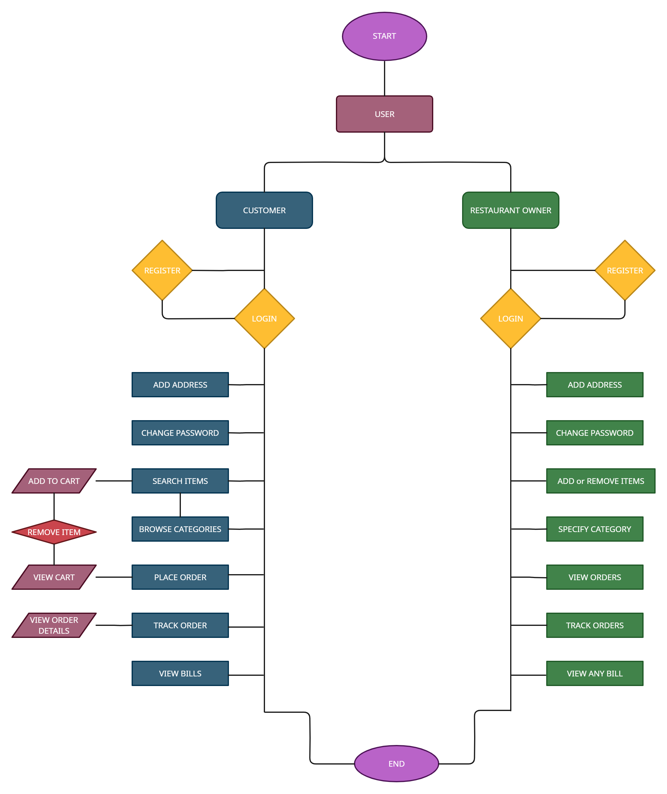

# MEELS ON WHEELS

 

    

# MEELS ON WHEELS

**REST API SERVICE**

The **MEELS ON WHEELS** is a REST API, which allows **Customers** to browse the food, **Save** them to **Cart** for future, perform all the basic fundamental **CRUD** operations like any other **Online Food Ordering and Delivery Application** and place orders as per their requirements. It is also allow **Restaurant** can **Add the food**, can manage **Cost** and **Quantity**.

The **MEELS ON WHEELS** API also provides **User, Admin Validation & Authentication** for every operation and simplified Exception Handling for layman's easy understanding.

The API's primary objective is to provide to the Customer **a Simple & User-Friendly online food ordering Experience.**

The API's Services will be used by the **Three** categories of users:

- **Admin (Administrator)**

- **User (Customer)**

- **User (Restaurant)**

## Tech Stack

- JAVA
- SPRINGBOOT
- HIBERNATE
- MAVEN
- MYSQL
- SWAGGER UI

## Dependencies

- SPRING DATA JPA
- SPRING BOOT DEVTOOLS
- SPRING WEB
- HIBERNATE
- MYSQL DRIVER
- VALIDATION
- LOMBOK
- SWAGGER UI

## Modules

- Restaurant Module
- Customer Module
- Admin Module
- Food Module
- Cart Module
- Order Module
- Bill Module
- Exception Handler Module

## System Structure

The REST API allows a Customer to **Signup, Login** & **Browse** through the food, view product as well as Restaurant and add food to **Cart** wishlist, as well as for the Restaurant to **View** all the **Orders, Customers & food**.

Restaurant can **Add, Update, View, Delete** **Food** from the **Database**.

Administrator can **View request Delete Account List** and **Delete the Account As Per Request**.

## About

This project is a team project of 4 members, This is an online ordering and delivery Rest API. We built this Rest API project Within 5 days.

## Feature

- ## Restaurant

  - Signup
  - Login & Logout
  - View all Food
  - View all Orders of an Customer as order that Restaurant
  - Add New Food into Database
  - Remove Food from Database
  - Update Food in Database
  - Update their Profile

- ## Customer

  - Signup
  - Login & Logout
  - Update all Personal Details
  - View all Food .
  - Add Food to Cart
  - Update Food Quantity in Cart
  - Delete Food from Cart
  - Empty Cart
  - Add Order
  - Cancel Order
  - View Orders

- ## Administrator
  - Login
  - View Deleted Account Request
  - Delete Account as per Request

# FLOW CHART

# Entity Relationship Diagram

